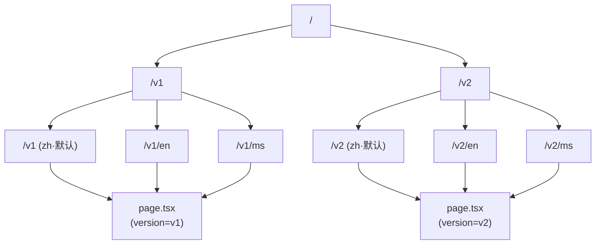
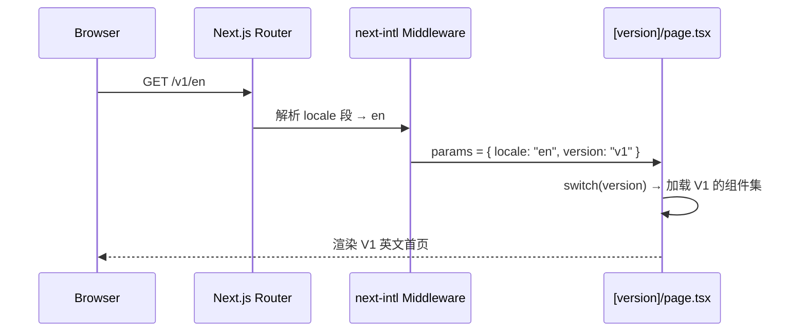

# 多版本路由架构方案 A (Multi-Version Routing)

> **适用阶段：** 演示 / 多版本并行开发期  
> **策略：** `[version]` + `[locale]` 双动态段，版本层对 i18n 透明

---

## 1. 目标

- 同一域名下，同时承载多个独立的首页版本（如 `v1`、`v2`）
- 每个版本都支持完整的三语言（`zh`、`en`、`ms`）
- 不破坏现有的 `[locale]` 架构与 `next-intl` 配置
- 版本之间组件级别完全隔离，互不影响

---

## 2. URL 结构

```
/v1              → v1 · 中文（默认语言，无前缀）
/v1/en           → v1 · 英文
/v1/ms           → v1 · 马来文

/v2              → v2 · 中文
/v2/en           → v2 · 英文
/v2/ms           → v2 · 马来文
```

> 默认语言 `zh` 遵循 `localePrefix: 'as-needed'`，不显示语言前缀，与现有行为一致。

---

## 3. 路由流图



---

## 4. 目录结构变化

### 现状（当前）

```
app/
└── [locale]/
    ├── layout.tsx
    ├── page.tsx          ← 只有一条首页
    └── not-found.tsx
```

### 目标（方案 A 实施后）

```
app/
└── [locale]/
    ├── layout.tsx        ← 不变，i18n 层继续由此管理
    ├── page.tsx          ← 保留，作为默认 / 兼容入口（可跳转到 /v1）
    ├── not-found.tsx     ← 不变
    └── [version]/
        ├── page.tsx      ← 核心：根据 version 参数渲染对应版本的首页
        └── layout.tsx    ← 可选：若不同版本有不同的 Header/Footer 可在此覆盖
```

---

## 5. 核心数据流



---

## 6. `[version]/page.tsx` 核心实现思路

```typescript
// app/[locale]/[version]/page.tsx

type Props = {
  params: Promise<{ locale: string; version: string }>;
};

export default async function VersionedHome({ params }: Props) {
  const { version } = await params;

  switch (version) {
    case 'v1':
      return <HomeV1 />;
    case 'v2':
      return <HomeV2 />;
    default:
      notFound();
  }
}

// generateStaticParams 列举所有合法版本
export function generateStaticParams() {
  return [{ version: 'v1' }, { version: 'v2' }];
}
```

---

## 7. 组件目录约定

每个版本的首页组件放在各自独立的目录下，完全隔离：

```
components/
├── home/          ← 现有版本（当前演示用的默认版）
│   ├── Hero.tsx
│   ├── HotelIntro.tsx
│   └── ...
├── home-v1/       ← v1 版本独立组件集
│   ├── Hero.tsx
│   └── ...
└── home-v2/       ← v2 版本独立组件集
    ├── Hero.tsx
    └── ...
```

多语言 messages 也按版本拆分（可选）：

```
messages/
├── en.json        ← 当前默认
├── v1/
│   ├── en.json
│   └── zh.json
└── v2/
    ├── en.json
    └── zh.json
```

---

## 8. next-intl 配置调整

`i18n/routing.ts` **无需改动**，版本段对 next-intl 完全透明。

只需在 `middleware.ts`（若有）确保匹配规则不会将 `version` 段错误地识别为 `locale`：

```typescript
// middleware.ts
export default createMiddleware(routing);

export const config = {
  // 排除 _next 静态资源；同时确保 /v1、/v2 等路径走正常匹配
  matcher: ['/((?!_next|_vercel|.*\\..*).*)'],
};
```

---

## 9. 版本切换入口（可选 UI）

演示阶段可在 Header 或独立的 Demo Banner 中加入版本切换按钮，方便客户在不同版本之间切换对比：

```
┌─────────────────────────────────────────┐
│  DEMO  [v1]  [v2]  · 语言: ZH EN MS     │  ← 固定顶部 Banner
└─────────────────────────────────────────┘
```

---

## 10. 实施优先级

| 优先级 | 任务 |
|---|---|
| P0 | 创建 `app/[locale]/[version]/page.tsx`，接入第一个版本 `v1` |
| P0 | 将现有 `components/home/` 内容平移到 `components/home-v1/` |
| P1 | `app/[locale]/page.tsx` 默认重定向至 `/v1` |
| P1 | 实现版本切换 Demo Banner |
| P2 | messages 按版本拆分（如版本间文案差异较大时才需要） |
